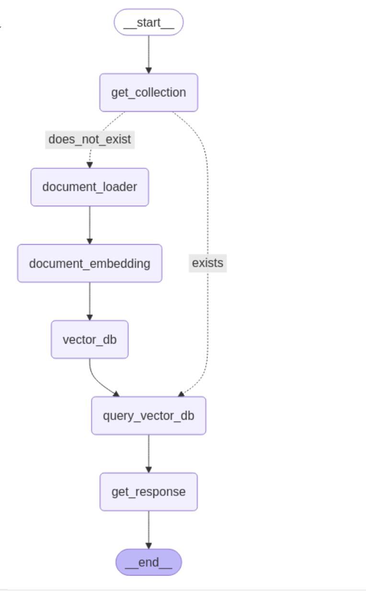

## Overview
Codebase QnA Search is a tool for developers to easily search and find answers in codebases. It uses advanced technologies like the LlamaIndex Framework for indexing, the LangGraph Framework for organizing data, and a pipeline to process and embed code repositories. The tool includes a smart query engine for accurate and context-aware searches. By integrating OpenAI and Hugging Face APIs, it offers features like embeddings, inference, and chat, making it a valuable resource for understanding large codebases.

## Scope
The scope of Codebase QnA Search is to empower developers with an efficient tool for navigating and understanding large codebases. By leveraging advanced indexing and data organization frameworks, the tool simplifies the process of searching for specific code elements or gaining insights into the structure and functionality of a repository. It integrates state-of-the-art APIs for embeddings, inference, and conversational interactions, ensuring accurate and context-aware results. The tool is designed to enhance productivity, streamline codebase exploration, and support developers in maintaining and improving complex software systems.

## Setup Steps
1. Clone the repository:
    ```bash
    git clone https://github.com/your-repo/codebase-qna-search.git
    cd codebase-qna-search
    ```

2. Set up a Python virtual environment:
    ```bash
    python3 -m venv venv
    source venv/bin/activate
    pip3 install -r requirements.txt 
    ```

3. Configure environment variables:
    - Create a `.env` file in the root directory.
    - Add these variables:
      ```
      SERVICE= # Choose "openai" or "huggingface"
      HUGGING_FACE_HUB_TOKEN=<your-token>
      OPENAI_API_KEY=<your-api-key>
      HF_MODEL_NAME=<model-name>
      ```

4. Run the application:
    ```bash
    python3 main.py
    ```

## How It Works
1. **Define State**: Set up the configuration for processing documents, handling queries, and storing data.
2. **Define Nodes**: Nodes represent parts of the codebase like files, functions, or classes. They work together in a structured graph.
3. **Define Routes**: Routes guide the workflow by checking collections in the database and directing processes.
4. **Create State Graph**: Build a graph connecting nodes and edges to define workflows and interactions.
5. **Define Edges**: Edges show how nodes are connected and how data flows between them.
6. **Run Application**: Start the tool to process the codebase and handle queries.

## Compiled Graph



